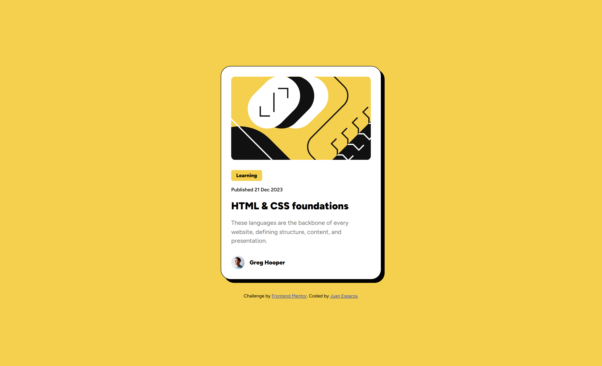
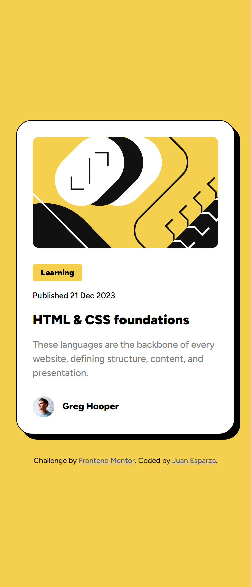

# Frontend Mentor - Blog preview card solution

This is a solution to the [Blog preview card challenge on Frontend Mentor](https://www.frontendmentor.io/challenges/blog-preview-card-ckPaj01IcS). Frontend Mentor challenges help you improve your coding skills by building realistic projects.

## Table of contents

- [Overview](#overview)
  - [The challenge](#the-challenge)
  - [Screenshot](#screenshot)
  - [Links](#links)
- [My process](#my-process)
  - [Built with](#built-with)
  - [What I learned](#what-i-learned)
  - [Continued development](#continued-development)
  - [Useful resources](#useful-resources)
- [Author](#author)
- [Acknowledgments](#acknowledgments)

**Note: Delete this note and update the table of contents based on what sections you keep.**

## Overview

### The challenge

Users should be able to:

- See hover and focus states for all interactive elements on the page

### Screenshot

- Desktop view 
- Mobile view 

### Links

- Live Site URL: [blog preview card]()

## My process

### Built with

- Semantic HTML5 markup
- CSS custom properties
- Flexbox
- Mobile-first workflow

### What I learned

I learned that you don't need media queries for responsive typography just use clamp().

```css
.how-to-use-clamp {
  font-size: clamp(min, prefered, max);
}
```

Using clamp scales the font size with only one line of css.

### Continued development

I want to continue learning about responsive web design and other use cases for clamp().

### Useful resources

I used MDN for the documentation about the clamp method.

## Author

- Frontend Mentor - [@JEWebDev](https://www.frontendmentor.io/profile/JEWebDev)

## Acknowledgments

Thank you frontend mentor team!
